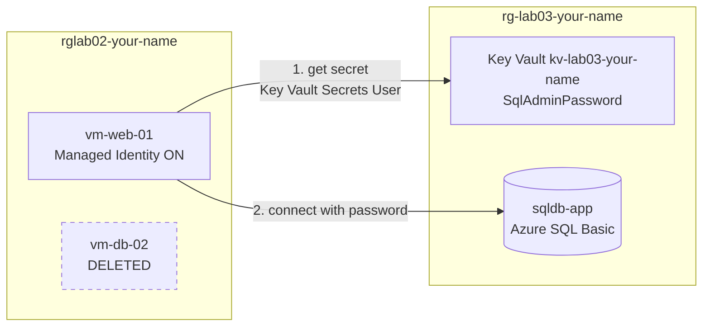

# Modernizing to PaaS and Securing Secrets on Azure

**Status:** Built and verified through the Key Vault test. Part 1 (deleting the database VM) and the Metrics chart are still to do. <!-- When everything is done and the resources are deleted, replace with: "Built, deployed, and verified end-to-end. Cleaned up after testing to avoid ongoing charges." Only after it is true. -->

## 🎬 Video Walkthrough

<!-- After recording: replace YOUR-VIDEO-ID with your Loom video ID (the last part of the share link) -->
[](https://www.loom.com/share/YOUR-VIDEO-ID)

---

## Project Overview

Replaces the database VM from my Lab 02 network with Azure SQL Database, stores the database password in Azure Key Vault, and lets the web server VM read that password through a Managed Identity instead of a hardcoded credential.

The common shortcut is to run the database on a VM and keep its password in a config file on the web server. That leaves you patching the OS, managing backups, and hoping nobody reads the file. The standard design uses a managed database and keeps the password in one audited place, with access granted to an identity instead of a person. This project builds that design and then proves it works by requesting a token from the VM and reading the secret.

## Skills Demonstrated

- IaaS to PaaS migration: replacing a self-managed database VM with Azure SQL Database
- Azure Key Vault: storing and reading secrets, Azure RBAC permission model
- System-assigned Managed Identity for passwordless authentication between Azure resources
- Least privilege with RBAC: Key Vault Administrator for setup, Key Vault Secrets User for the VM
- Cost control: catching a $640 per month default and choosing the Basic DTU tier
- Basic observability with Azure Monitor metrics
- Testing access from the resource that needs it, not only checking that a role assignment exists
- Troubleshooting Azure portal and SSH issues from error messages

## Key Concepts

| Term | Plain-language meaning |
|---|---|
| **IaaS vs PaaS** | With IaaS (a VM) you manage the OS and database software. With PaaS (Azure SQL) Microsoft manages them and you just use the database. |
| **Refactoring** | Changing how something is built without changing what it does. |
| **Key Vault secret** | A sensitive value, such as a password, stored outside your code and config files. |
| **Managed Identity** | An identity Azure attaches to a resource (here, the VM). The VM proves who it is without a stored password. |
| **RBAC role assignment** | Who (the identity), what (a role), and where (the scope, here the Key Vault). |
| **DTU** | A blended unit of CPU, memory, and I/O used to size Azure SQL Basic and Standard tiers. |

## Architecture


- `vm-web-01` (from Lab 02) has a system-assigned Managed Identity and the **Key Vault Secrets User** role on the vault. It can read secrets and nothing else.
- Key Vault holds `SqlAdminPassword` and uses the Azure RBAC permission model.
- `sqldb-app` runs on Azure SQL Database (Basic tier) behind the logical server `sql-server-your-name`.
- The old database VM `vm-db-02` and its NIC, disk, NSG, and SSH key are deleted in Part 1.
- Editable source: [`docs/architecture.drawio`](docs/architecture.drawio) (open at [app.diagrams.net](https://app.diagrams.net))

**Key point:** the Managed Identity only covers the connection to Key Vault. The database still uses a SQL login, so the VM needs the password from Key Vault to connect. Switching the database to Microsoft Entra authentication would remove that password entirely (see Known Limitations).



## Prerequisites

- [ ] Active Azure subscription
- [ ] Lab 02 complete, with `vm-web-01` **Running**
- [ ] Terminal with an SSH client (I used WSL Ubuntu on Windows)

## Naming Conventions

| Resource | Name | Region |
|---|---|---|
| Resource group (Lab 02, existing) | `rglab02-your-name` | East US |
| Resource group (Lab 03, new) | `rg-lab03-your-name` | Central US |
| SQL server | `sql-server-your-name` | Central US |
| SQL database | `sqldb-app` | Central US |
| SQL admin login | `sqladmin` | |
| Key Vault | `kv-lab03-your-name` | East US |
| Secret | `SqlAdminPassword` | |

Replace `your-name` with your own lowercase name or initials. SQL server and Key Vault names are public DNS names, so they must be unique across all of Azure. East US was blocked for SQL on my subscription (see Troubleshooting), so the SQL resources are in Central US, while Key Vault and the VM are in East US. Use any region your subscription allows.

## Project Steps

> Screenshots go in `docs/screenshots/` with the filenames shown. Passwords, secret values, and subscription IDs are blurred or left out.

### Part 1: Decommission the old database VM

In my Lab 02 build, both VMs and the VNet are in one resource group, `rglab02-your-name`. Five of its 12 resources belong to the database VM.

1. **Resource groups** → open `rglab02-your-name`.
2. Select the five resources tied to the database VM: `vm-db-02` (VM), `vm-db-02<digits>` (NIC), `vm-db-02_disk1_...` (OS disk), `vm-db-02-nsg` (NSG), and `vm-db-02_key` (SSH key). Leave `vm-web-01`, its public IP, NIC, NSG, disk, and key, and `vnet-your-name`.
3. Click **Delete**, type `delete`, and confirm. If Azure blocks it because a resource is in use, delete the VM first, then the NIC and disk, then the NSG and SSH key.
4. Confirm `vm-web-01` and its resources are still there and **Running**.

A stopped VM still bills for its disk and IP, which is why these are deleted instead of stopped.


### Part 2: Deploy Azure SQL Database

1. Search **SQL databases**, open the **+ Create** dropdown, and choose **SQL database** (not the Free offer).
2. Resource group: **Create new**, `rg-lab03-your-name`. Database name: `sqldb-app`.
3. Server: **Create new**.
   - Name `sql-server-your-name`, location Central US (East US was blocked)
   - Authentication: **Use SQL authentication**
   - Admin login `sqladmin` and a strong password saved in a password manager
4. SQL elastic pool: **No**. Workload environment: **Development**.
5. **Configure database** → purchasing model **DTU-based** → **Basic** (5 DTUs, 2 GB, about $4.90 per month) → **Apply**.
6. Backup storage redundancy: **Locally-redundant (LRS)**.
7. **Networking** tab: Connectivity **Public endpoint**, **Allow Azure services** Yes, **Add current client IP** Yes. Leave TLS at 1.2.
8. **Security** tab: Microsoft Defender for SQL **Not now**. Skip the other tabs.
9. **Review + create**, check the tier and resource group, then **Create**. It took about 2 to 3 minutes.


### Part 3: Deploy Azure Key Vault

1. Search **Key vaults** → **+ Create**.
2. Resource group `rg-lab03-your-name`, name `kv-lab03-your-name`, region East US, tier **Standard**.
3. Leave soft-delete at its default and **purge protection disabled**, so the vault can be fully deleted during cleanup.
4. **Access configuration:** keep **Azure role-based access control**. Leave the three resource-access checkboxes unchecked.
5. **Networking:** public access on, all networks. Acceptable for a lab and not for production.
6. **Review + create** → **Create**.
7. Give yourself access: Key Vault → **Access control (IAM)** → **+ Add** → **Add role assignment** → **Key Vault Administrator** → assign to your own account. Wait 1 to 2 minutes.

My subscription-level **Owner** role manages resources but does not read secrets, so the vault needed its own data-plane role.


### Part 4: Store the SQL password as a secret

1. Key Vault → **Objects** → **Secrets** → **+ Generate/Import**.
2. Name `SqlAdminPassword`. Value: the SQL admin password from Part 2. Leave everything else at default.
3. Click **Create**.


### Part 5: Enable Managed Identity and grant Key Vault access

**Enable the identity**

1. `rglab02-your-name` → `vm-web-01` → **Identity** → **System assigned**.
2. Set Status to **On**, click **Save**, then **Yes**.
3. Note the **Object (principal) ID** that appears.


**Grant read access, from the Key Vault itself**

1. Open `kv-lab03-your-name`, then **Access control (IAM)** → **+ Add** → **Add role assignment**.
2. Role: **Key Vault Secrets User**. This gives read access to secret values and nothing more.
3. Members: **Managed identity** → **+ Select members** → **Virtual machine** → `vm-web-01`.
4. On the review page, check that the **Scope** ends in `.../vaults/kv-lab03-your-name`. Then **Review + assign** twice.


### Part 6: Verify that the VM can read the secret

A role assignment shows the permission exists, not that it works, so I test it from the VM.

1. SSH into `vm-web-01`. The prompt must read `azureuser@vm-web-01`.
2. Request a token from the instance metadata service, then use it to read the secret's metadata:

```bash
sudo apt update && sudo apt install -y jq

TOKEN=$(curl -s -H "Metadata:true" \
  "http://169.254.169.254/metadata/identity/oauth2/token?api-version=2018-02-01&resource=https://vault.azure.net" \
  | jq -r .access_token)

curl -s -H "Authorization: Bearer $TOKEN" \
  "https://kv-lab03-your-name.vault.azure.net/secrets/SqlAdminPassword?api-version=7.4" \
  | jq -r .id
```

It prints the secret's ID, not its value. A `Forbidden` error usually means the role has not propagated yet, so wait a minute and run the last two commands again.


### Part 7: Validate with Azure Monitor

1. Open the **database** `sqldb-app`, not the server.
2. **Monitoring** → **Metrics**. Metric **DTU percentage** (or **CPU percentage** if DTU is not listed), aggregation **Max**.
3. A visible line, even near zero, shows the database is live and monitored. A new database can take several minutes to report.


## Result

| Test | Expected | Actual |
|---|---|---|
| Database VM, NIC, disk, NSG, and SSH key deleted; `vm-web-01` still Running | Yes | Done. Deleted all five, and vm-web-01 |
| `sqldb-app` status and tier | Online, Basic | Online, Basic (5 DTU), about $4.90 per month, Central US |
| `SqlAdminPassword` in Key Vault | Enabled | Enabled |
| Managed Identity on `vm-web-01` | On | On. `vm-web-01` appeared in the role picker and the token request worked |
| `vm-web-01` role on the vault | Key Vault Secrets User | Key Vault Secrets User, scope This resource, confirmed on the vault's Role assignments tab |
| VM reads the secret using its identity | Secret ID returned | Returned `.../secrets/SqlAdminPassword/<version>`. The password was never printed |
| Metrics chart for `sqldb-app` | Line visible | Done. Chart shows a line for sqldb-app |

The Part 6 test is the clearest evidence: the VM received a token from the metadata service, Key Vault accepted it, and no password was typed or stored on the VM.

## Troubleshooting

Everything in this table happened during this build.

| Symptom | Cause | Solution |
|---|---|---|
| "Your subscription does not have access to create a server in the selected region" on the SQL server panel | My subscription has no SQL capacity in East US | Chose Central US for the SQL server and database. Key Vault stayed in East US |
| Cost card showed about $640 per month (Hyperscale) | The workload environment defaults to Production, which defaults to Hyperscale | Set the environment to Development, then **Configure database** → DTU-based → Basic, about $4.90 per month |
| Server panel had **Entra-only authentication** selected | Portal default. It disables username and password login, which this lab needs for the stored SQL password | Selected **Use SQL authentication** and set `sqladmin` with a strong password |
| Role assignment page showed `rg-lab03-your-name` in the breadcrumb, and `vm-web-01` ended up with Key Vault Secrets User on the whole resource group | I opened Access control (IAM) from the resource group instead of the Key Vault | Deleted the resource-group assignment and re-added it from the Key Vault. I now check that the Scope line ends in `.../vaults/kv-lab03-your-name` before confirming |
| `Permission denied (publickey)` when connecting to `vm-web-01` with the key already loaded in the agent | _Fill in the real cause, for example the key belonged to a different VM_ | _Fill in what finally worked, for example the matching `.pem` or resetting the VM's SSH key_ |
| "Error retrieving data" on the database's utilization chart and Metrics page, and DTU percentage hard to find | _Fill in only if you confirm a cause, for example a new database that had not reported yet_ | _Fill in what worked, for example waiting and refreshing, or using CPU percentage_ |

## Cleanup

Delete both resource groups after recording. Keep `NetworkWatcherRG`, which is free.

```bash
az group delete --name rg-lab03-your-name --yes --no-wait
az group delete --name rglab02-your-name --yes --no-wait
```

You can also do this in the portal under **Resource groups**. Deleting `rg-lab03-your-name` removes the SQL server, database, and Key Vault. Purge protection is off, so the soft-deleted vault can be purged to reuse its name.

Then remove the keys from the machine:

```bash
ssh-add -D
rm ~/.ssh/your-key.pem
```

Delete the copies in your Windows Downloads folder too.

## Key Takeaways

- **PaaS trades control for less operational work.** Patching, backups, and availability move to Microsoft, and you lose OS-level access.
- **A Managed Identity removes the password problem for the VM.** There is no credential on the server to leak, rotate, or commit to source control.
- **The identity only covers the Key Vault hop.** The database still uses SQL authentication, so the password still exists, just in a safer place.
- **Check the Scope line before confirming a role.** I applied a role at the resource group first, which was broader than least privilege allows.
- **Management access and data access are separate.** Owner on the subscription manages resources, and the vault needed Key Vault Administrator for secrets.
- **A role assignment is not proof that access works.** Test it from the resource that needs it.
- **Read portal defaults before clicking Create.** Production, Hyperscale, and Entra-only authentication were all defaults that would have broken the lab or cost real money.

## Known Limitations

- Key Vault allows access from all networks and SQL uses a public endpoint. Production would use private endpoints and restricted networks.
- SQL authentication with a shared admin password keeps the lab simple. Production would prefer Microsoft Entra authentication, so the app connects with its identity and no SQL password is stored at all.

---

**Author:** Manuel Yannick Armah 

**Project:** Modernizing to PaaS and Securing Secrets on Azure

**Difficulty:** Intermediate 

**Time to Complete**: 60 minutes
